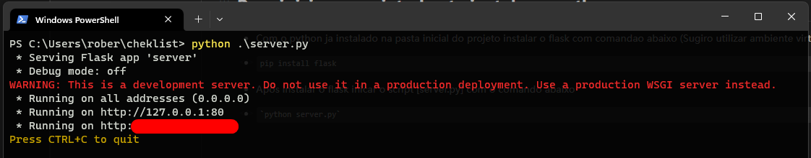

# Checklist veicular

Uma solução simples para realizar inspeções veiculares, ideal para o gerenciamento de frotas. Este projeto foi desenvolvido com o objetivo de aplicar os conhecimentos adquiridos na linguagem de programação JavaScript.


# Detalhes do projeto

Objetivo: Registrar situacao e condicoes do veiculo em uma organizacao

Este projeto esta usando linguagem de programacao python como servidor local.

https://github.com/jr-roberto/projeto-cheklist/assets/91014834/322e8c1b-77d6-48fd-888e-278e9c4c97e2


# Para iniciar o projeto basta instalar o python

* Com o python ja instalado na pasta inicial do projeto instalar o flask com comandao abaixo (Sugiro utilizar ambiente virtual)
* ```
  pip install flask
  ```
* Apos instalar o flask inicar o script [server.py] com o comando abaixo
* ```
  python server.py
  ```

Apos iniciar o aplicativo estara disponivel em sua rede local. sera conforme tela abaxo.


